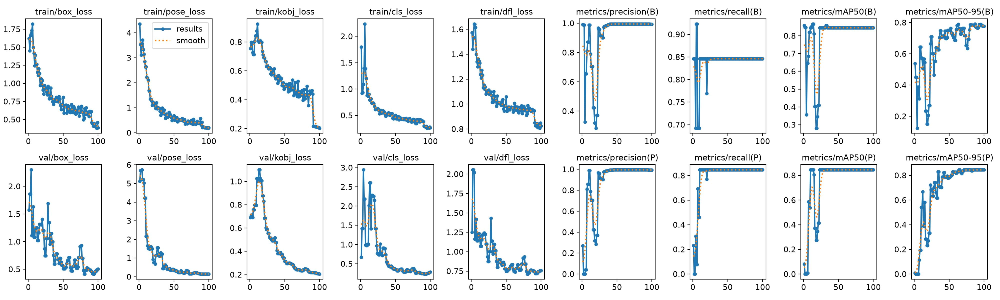

# Robot Arm Keypoint Detection

Pose estimation model trained with YOLOv8n-pose to detect joints of a robot arm. This project includes building model training and testing pipeline, as well as local environment setup on Jupyter notebook. The dataset used for this pose detection is originally published by [lin] on Roboflow ([https://universe.roboflow.com/lin-dwhdl/robot-arm-pose-sz7o3/dataset/1]),  


## Setup

1. Clone the repo and create a virtual environment:
   ```
   python -m venv yolo_venv
   yolo_venv\Scripts\activate      # Windows
   pip install -r requirements.txt
   ```

2. Create a `.env` file (see `.env.example`) with your Roboflow API key:
   ```
   ROBOFLOW_API_KEY=your_key_here
   ```

3. Open `robot-arm-keypoints-local.ipynb` in VS Code, select the `yolo_venv` kernel, and run all cells.

## Training

- Base model: `yolov8n-pose.pt`
- Epochs: 100
- Image size: 640
- Batch size: 8 (trained locally on a 4GB GTX 1650 and can be adjusted if GPU limits are hit)

## Results

| Metric | Value |
|---|---|
| Precision | 0.995 |
| Recall | 0.846 |
| mAP50 | 0.845 |
| mAP50-95 | 0.791 |



Sample predictions:

  

## Note

- The model was trained and validated both on Kaggle ( with GPU T4 X 2 accelerator) and locally (GTX 1650) — results are consistent between environments.
